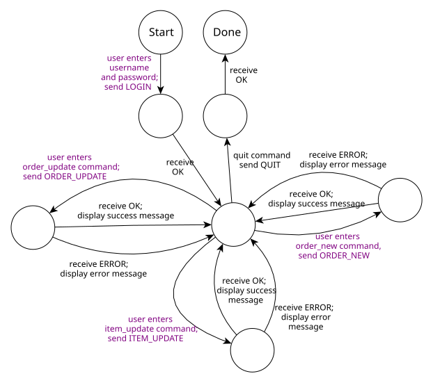
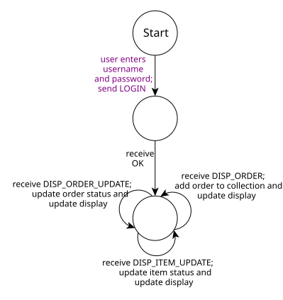
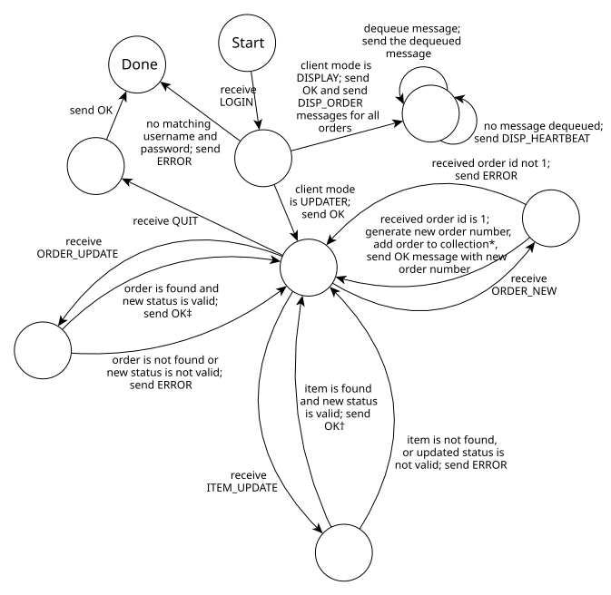

*Note*: Assignment 5 is a double assignment. Each milestone (MS1 and MS2)
is worth 1/6 of the assignments grade for the course, the same as
(individually) Assignments 1–4.

**Due:**

* Milestone 1 due **Mon Apr 20th** by 11pm
* Milestone 2 due **Mon Apr 27th** by 11pm (no late hours allowed)

Note that you may **not** use late hours on Milestone 2.
Please plan accordingly.

## Quick Guide

Here are the high-level steps we recommend for completing the assignment.

For Milestone 1:

1. Implement the `Wire::encode` and `Wire::decode` functions.
   Get all of the unit tests in the `message_tests` unit test program
   working. (See the [Encoding](#encoding) section.)
2. Implement the `IO::send` and `IO::receive` functions.
   Get all of the unit tests in the `io_tests` test program
   working. (See the [Framing](#framing) section.)
3. Implement the `updater` client and test it
4. Implement the `display` client and test it

For Milestone 2:

1. Implement the `Server::server_loop` member function so that
   the server listens for TCP connections from clients. For each
   client that connects, create a `Client` object, and in a new
   detached thread, call its `chat` member function to communicate
   with the remote client.
2. Implement the `Client::chat` member function sufficiently that
   the client can log in
3. Add functionality to the `Client` and `Server` classes to implement
   the required server functionality. You'll need to add a central
   data structure to `Server` to keep track of orders, and use
   appropriate synchronization so that client threads can access the
   data concurrently.
4. Implement the protocol for communicating with an updater client.
   This will involve code in both `Server` and `Client`.
5. Implement the protocol for communicating with a display client.
   Each `Client` should have a `MessageQueue` object that the
   code in the `Server` object can use to post messages to be
   sent to the remote display client program which the state of
   any order or item changes. You'll need to implement the
   `MessageQueue::enqueue` and `MessageQueue::dequeue` member
   functions.

Milestone 2 tasks 3–5 will likely be the most challenging ones, although they
should only involve a couple hundred lines of code, which should be
fairly straightforward if you have thought about the problem and
determined how to factor the problem into helper functions.

## This Assignment Description is Complicated, Help!

Specifying the intended behavior of a networked application entails
some complexity. This assignment description aims to document everything
you need to know to implement the server and clients for the
restaurant order system.

The good news is that the assignment skeleton file (see
[Getting Started](#getting-started) includes reference executables
for all three programs. You can use them as reference for how
your programs should work. Also, you can use them to test your
programs. For example, in Milestone 1, it will make sense to use
the reference server implementation to test your client program
implementations against.

Also, the two unit test programs should make it fairly straightforward
to implement encoding, decoding, sending, and receiving of messages.
Once that code works, implementing the actual application protocol
is relatively easy, and fun!

## Grading Criteria

TODO

## Getting Started

To get started, download [csf\_assign05.zip](csf_assign05.zip) and unzip it.

In the extracted `csf_assign05` directory, the `include` directory has header
files and the `src` directory has C++ source files. The `build` directory is
where compiled object files and executable files will be generated.

## Overview

In this assignment, you will implement two network clients and a network server
which together form a restaurant order system. The general idea is that
this system could be used to keep track of current orders in a restaurant,
encompassing point of sale (order entry), display (so the workers in the
kitchen can see what needs to be prepared), and updating the status of
orders (so that the back of house staff can see which items still need to
be prepared, and deliver the food to the wait staff when the items are
ready.)

The server maintains a collection of *orders*. Each order is a collection
of *items*. Full details about orders and items are given in the
[Object Model](#object-model) section.

The *updater* client creates new orders and updates the status of existing
items and orders. The *display* client shows the current state of all active
orders and their constituent items.

The clients and server communicate with each other by sending *messages*.
Full details about messages, their encoding, and the general network protocol
are given in the [Protocol](#protocol) and [Encoding](#encoding) sections.

## Restaurant Order System

This section documents the object model and network protocol to be implemented
in the restaurant order system.

### Object Model

The *object model* is the collection of data types representing orders, items, and
their statuses. All of these types are defined in the `include/model.h` header file.

`OrderStatus` is an enumeration type representing the status of an order. Its
members are `OrderStatus::INVALID`, `OrderStatus::NEW`, `OrderStatus::IN_PROGRESS`,
`OrderStatus::DONE`, and `OrderStatus::DELIVERED`. (Note that `OrderStatus::INVALID`
is not a valid status, and is used only to represent the absence of a valid
order status.)

`ItemStatus` is an enumeration type representing the status of an item within an
order. Its members are `ItemStatus::INVALID`, `ItemStatus::NEW`, `ItemStatus::IN_PROGRESS`,
and `ItemStatus::DONE`. (As with `OrderStatus`, the `ItemStatus::INVALID` member
is not a valid status.)

The `Order` class represents an order and its constituent items. It has a unique
integer identifier, and `OrderStatus` value, and a collection of item objects.

The `Item` class represents an item within an order. It has an order id (which is
the unique id of the order the item is part of), an integer item id (which is
unique within the overall order), an `ItemStatus` value, a description string, and
an integer quantity (which must be positive).

The `Order` and `Item` classes have a variety of accessor functions for inspecting
and modifying their data.

### Messages

A *message* is a bundle of information sent from client to server (a "request")
or from server to client (a "response"). The `Message` class, defined in
`include/message.h`, represents one message.

The `MessageType` enumeration defines the various types of messages. These will
be described in more detail in the [Protocol](#protocol) section.

The `Message` class is designed to be able to represent any message.
Each message type has a specific combination of data values it contains.
So, the `Message` class's fields and accessor functions represent the
union of all data values a single message could contain.

### Protocol

The following table summarizes the message types, which program sends
messages of that type, and what information a message of that type will
contain.

Message type                      | Sent by            | Reeived by         | Contained data values
--------------------------------- | ------------------ | ------------------ | ---------------------
`MessageType::LOGIN`              | updater or display | server             | client mode, string
`MessageType::QUIT`               | updater            | server             | string
`MessageType::ORDER_NEW`          | updater            | server             | order
`MessageType::ITEM_UPDATE`        | updater            | server             | order id, item id, item status
`MessageType::ORDER_UPDATE`       | updater            | server             | order id, order status
`MessageType::OK`                 | server             | updater or display | string
`MessageType::ERROR`              | server             | updater or display | string
`MessageType::DISP_ORDER`         | server             | display            | order
`MessageType::DISP_ITEM_UPDATE`   | server             | display            | order id, item id, item status
`MessageType::DISP_ORDER_UPDATE`  | server             | display            | order id, order status
`MessageType::DISP_HEARTBEAT`     | server             | display            | *none*

The protocols implemented by the updater client, display
client, and server are described by the following state machines.
In each state machine, the nodes (circles) represent states,
and the transitions (arrows) represent events. Each transition
involves either sending or receiving a message. The "Start"
node represents the initial state, and the "Done" node indicates
that the conversation has finished and the network connection
will be terminated.

Note that the edge labels in <span style="color: #800080;">purple</span>
represent interactive commands that the user enters.

**Updater state machine**:

<a href="img/assign05/updater-sm.svg">
  
</a>

**Display state machine**:

<a style="margin-left: 6em;" href="img/assign05/display-sm.svg">
  
</a>

**Server state machine**:

<a href="img/assign05/server-sm.svg">
  
</a>

The server state machine describes the protocol implementing a conversation
between the server and one client.

Note the following special cases in the server's state machines (indicated with
the \*, †, and ‡ symbols in the state diagram):

\* When a new order is created and added to the collection, the server should
enqueue a `MessageType::DISP_ORDER` message containing the order data to
the message queues of each active display client.

† When a `MessageType::ITEM_UPDATE` message is successfully processed, the server
should enqueue a `MessageType::DISP_ITEM_UPDATE` message containing the item id
and new item status to the message queues of each active display client. Also,
if as a result of applying the item update, the order status transitions from
`OrderStatus::NEW` to `OrderStatus::IN_PROGRESS`, or if the order status
transitions from `OrderStatus::IN_PROGRESS` to `OrderStatus::DONE`, the server
should enqueue a `MessageType::ORDER_UPDATE` with the order id and new order status
to the message queues of each active display client.

‡ When a `MessageType::ORDER_UPDATE` message is successfully processed, the
server should enqueue a `MessageType::DISP_ORDER_UPDATE` message with the
order id and new order status to the message queues of each active display
client.

### Encoding

In order to be sent and received via a TCP connection, a message is represented
as a string, i.e., a sequence of bytes. The `Wire::encode` and `Wire::decode`
functions (in `src/wire.cpp`) implement conversion of a `Message` object to and
from a string representation.

In the table of message types in the [Protocol](#protocol) section, you
will note that the last column is called "Contained data values". The
entries in this column describe the "payload" of the message. The string
representation of a message consists of the message type, followed by the
contained data values (in order), with all items separated by a single
"`|`" character.

A `MessageType` value can be converted to a string using the
`Wire::message_type_to_str` function.

Integer data values such as order id and item id are encoded as a sequence of
base 10 digits. You can use the `std::to_string` function to do this conversion.

`OrderStatus` and `ItemStatus` values can be converted to a string using
(respectively) the `Wire::order_status_to_str` and `Wire::item_status_to_str`
functions.

`MessageType::ORDER_NEW` and `MessageType::DISP_ORDER` messages contain an
`Order` as the payload value. An `Order` is converted to a string
consisting of the order id, order status, and item list, separacter by comma
("`,`") characters. The item list is a sequence of 1 or more items, separated
by semicolon (";") characters. Each item is encoded as a string consisting of
order id, item id, item status, description string, and integer quantity,
each separated by colon ("`:`") characters.

Note that you may assume that the separator characters "`|`", "`,`", "`;`", and
"`:`" will never occur in a string value within an encoded message.

The `message_tests` unit test program (`make build/message_tests`) has fairly
comprehensive unit tests for message encoding and decoding. When you reach
the point where all of the unit tests pass, you can have confidence that
your implementations of `Wire::encode` and `Wire::decode` are working correctly.

### Framing

Framing is the problem of determining where transmitted messages begin and
end. The framing format for messages in the restaurant order system consists
of a four-digit length value, followed by an encoded message string, followed
by a single newline ("`\n`") character. The length value specifies the number
of bytes comprised by the encoded message string and the newline. For example,
to frame the encoded message `OK|successful login`, the length value would
be `0020`, since the encoded message is 19 characters long, and the newline
contributes one extra character, for a total length of 20.

This framing scheme is an example of *run-length encoding*, which means that
messages are preceded by the exact length of the message contents to follow,
so that when receiving a message, the received can read the length (a known
number of bytes), and then know exactly how many additional bytes to expect.
Contrast this approach with a "terminating sentinel" style of framing, where
the end of a message is indicated by a special sentinel character or character
sequence.

The `IO::send` and `IO::receive` functions (in `src/io.cpp`) frame and
unframe a string value (i.e., an encoded message). `IO::send` writes the
framed string to a file descriptor (e.g., a TCP socket), and `IO::receive`
reads a framed string from a file descriptor. Note that these functions
should throw `IOException` if any I/O error or EOF occurs.

The `io_tests` unit test program (`make io_tests`) tests the implementation
of `IO::send` and `IO::receive`. Once these tests pass, you can be
reasonably confident that your implementations of `IO::send` and `IO::receive`
are working well.

### Sending and Receiving Messages

Once you have the encoding and framing functions working, it is very
easy to send and receive messages.

Let's say that a `Message` object `m` represents a message you want to send,
and that `fd` is the file descriptor of the TCP socket connecting to the
remote peer application.  You can do so with the code

```c++
std::string s;
Wire::encode(m, s);
IO::send(s, fd);
```

Similarly, if you want to receive a message from the remote peer, the code
would be something like

```c++
Message m;
std::string s;
IO::receive(fd, s);
Wire::decode(s, m);
// m now contains the received message
```

## Implementation details

This section has further information about implementing the clients and server.

### Shared Pointers

The model object classes (`Order`, `Item`, `Message`), and classes designed to be
containers for model objects (e.g., `Message` and `MessageQueue`) consistently
use `std::shared_ptr` to manage dynamically allocated objects. This approach
has some important advantages:

* `std::shared_ptr` uses reference counting, and deletes the managed object
  when the last pointer to it goes out of scope; this is a simple form
  of garbage collection, and ensures that allocated objects won't be leaked
* because objects managed by `std::shared_ptr` are dynamically allocated,
  they are safe to transfer from one thread to another

If you want to create an object to be managed by `std::shared_ptr`, don't use
the `new` operator, use the `std::make_shared` function. Its syntax is

<div class='highlighter-rouge'><pre>
std::make_shared&lt;<i>ClassName</i>&gt;(<i>ConstructorArgs</i>)
</pre></div>

where *ClassName* is the name of the class you want the new managed object to be
an instance of, and *ConstructorArgs* are any arguments you want to pass to the
constructor of the new object. For example, if `order` is a `std::shared_ptr`
managing an `Order` object, and you want to create a shared pointer to a new
`Message` object that you can use to broadcast that order to display clients as
a `MessageType::DISP_ORDER` message, you could use the code

```c++
auto order_new_msg =
  std::make_shared<Message>(MessageType::DISP_ORDER, order);
```

Note that shared pointers should be passed by value and returned by value
if you need to pass them to or return them from functions.

### The Updater Client

The updater client encapsulates both point-of-sale functionality (e.g.,
creating new orders) and back of house functionality (updating the status
of items and orders.)

The updater client is invoked as

```
./build/updater HOSTNAME PORT
```

where `HOSTNAME` is the hostname or IP address the server is running on,
and `PORT` is the TCP port number on which the server is listening for
connections.

When the updater client starts, it should prompt the user to enter a username
and password using the prompt text "`username: `" and "`password: `".
(Note that there is a space after the colon in each prompt, and also that
the program should not print a newline after the prompt.)

The updater client should combine the entered username and password into a
single credential string of the form "`username/password`", and send it to the
server as a `MessageType::LOGIN` message.  The server will respond with
either a `MessageType::OK` or `MessageType::ERROR` message. If an ok response is
received, the client continues to execute the command loop. Otherwise it prints an
error message of the form

<div class='highlighter-rouge'><pre>
Error: <i>error text</i>
</pre></div>

to `std::cerr` where *error text* is the string payload of the `MessageType::ERROR`
message received from the server.

The command loop works as follows. The client prints the prompt "`> `" and
reads a line of text, which is the command name. Commands are handled as follows:

`quit`: The client sends a `MessageType::QUIT` message to the server and
receives the server's response. The server should send back a `MessageType::OK`
message, and the client exits with an exit code of 0.

`order_new`: The client reads an integer number of items. Then, it reads
exactly that many items. Each item is read by reading an integer item id,
an item description string, and an integer quantity. The client then sends
a `MessageType::ORDER_NEW` message containing an order with the specified
items. The order id of the new order should be set to 1. The server will
respond with a `MessageType::OK` message. The text in that message will
have the form

<div class='highlighter-rouge'><pre>
<code>Created order id <i>OrderId</i></code>
</pre></div>

where *OrderId* is the actual order id assigned to the order.

`item_update`: The client reads an order id, item id, and item status.
It sends a `MessageType::ITEM_UPDATE` message with the information entered.
The server responds with a `MessageType::OK` or `MessageType::ERROR` message.

`order_update`: The client reads an order id and an order status.
It sense a `MessageType::ORDER_UPDATE` message with the information entered.
The server responds with a `MessageType::OK` or `MessageType::ERROR` message.

Note that when reading the additional values entered by the user
for the `order_new`, `item_update`, and `order_update` commands, each value
is read on a separate line, and the client should *not* print a prompt
for any of the entered values. You should use `std::getline` to ensure that
a complete line of text is read.

Note that there is no requirement to do anything special to handle invalid
commands or input values. When testing your updater client, the autograder will
only provide well-formed input.

For the `order_new`, `item_update`, and `order_update` commands, if the
server responds with `MessageType::OK`, the client should print a success
message to `std::cout` of the form

<div class='highlighter-rouge'><pre>
<code>Success: <i>text</i></code>
</pre></div>

where *text* is the string payload of the received message. If the
server responds with `MessageType::ERROR`, the client should print a failure
message to `std::cout` of the form

<div class='highlighter-rouge'><pre>
<code>Failure: <i>text</i></code>
</pre></div>

where *text* is the string payload of the received message.

Note that for these commands (the commands other than `quit`) the
command loop continues regardless of whether the response received
was `MessageType::OK` or `MessageType::QUIT`.

If any I/O errors occur, if any invalid or incorrectly-formed message data is
received, or if the server does not correctly implement the protocol as described
in the [Protocol](#protocol) section, the client should print an error message
of the form

<div class='highlighter-rouge'><pre>
<code>Error: <i>explanation</i></code>
</pre></div>

to `std::cerr`, where *explanation* is any arbitrary text. In addition, if
an error message is printed, the program should exit with a non-zero
exit code to indicate failure.

### The Display Client

The display client implements a basic information display showing the status
of all orders currently in the system.

It is invoked with the command

```
./build/display HOSTNAME PORT
```

where (as with the updater program) `HOSTNAME` is the hostname or IP address
of the system where the server is running, and `PORT` is the TCP port the
server is listening on.

The display client will prompt the user for a username and password
in exactly the same way as the updater client. A login failure should
be handled the same way as the updater client.

If the login is successful, the display client should clear the screen by
printing the contents of the `CLEAR_SCREEN` string to `std::cout`. Note that
you will need to flush the output buffer to make sure the contents of this
string are sent right away, i.e.

```c++
std::cout << CLEAR_SCREEN << std::flush;
```

Once the server responds with the `MessageType::OK` response to the
`MessageType::LOGIN` request, the display client should enter a loop
where it receives messages from the server. These messages should be handled
as follows:

`MessageType::DISP_ORDER`
: Add a new order to the collection of orders

`MessageType::DISP_ITEM_UPDATE`
: Update the status of a specific item within one of the current orders

`MessageType::DISP_ORDER_UPDATE`
: Update the status of a specific current order

`MessageType::DISP_HEARTBEAT`
: Do nothing; these messages are sent by the server only to detect display clients no longer connected

For all received messages other than `MessageType::DISP_HEARTBEAT` messages,
after processing the received message, the client should clear the screen,
and then refresh the display by printing the information in all orders.
The orders should be printed in increasing order by order id. (Hint: using a
`std::map` to manage the collection of current orders will make this easy.)

The format for printing each order is as follows.

To begin printing an order, print (to `std::cout`) a line of the form

<div class='highlighter-rouge'><pre>
Order <i>OrderId</i>: <i>OrderStatus</i>
</pre></div>

where *OrderId* is the order id, and *OrderStatus* is the order status.

Next, print each item, in the order in which the items appeared in the
earlier `MessageType::DISP_ORDER` message which added the order to the
display.

Printing an item consists of two lines. The first line has the form

<div class='highlighter-rouge'><pre>
  Item <i>ItemId</i>: <i>ItemStatus</i>
</pre></div>

where *ItemId* is the item id, and *ItemStatus* is the item status,
and the second line has the form

<div class='highlighter-rouge'><pre>
    <i>ItemDescription</i>, Quantity <i>Qty</i>
</pre></div>

where *ItemDescription* is the item description string, and
*Qty* is the item quantity.

Note that the first line of an item is preceded by two spaces,
and the second line of an item is preceded by four spaces.

Note that once the username and password have been entered, the display
client does not read any further user input. You can terminate a display
client by typing Control-C in the terminal it's running in.

### The Server

*More details coming soon!*

### Exceptions, RAII

We highly recommend using exceptions to deal with any exceptional circumstance
that means that control cannot continue normally in the program.

Some useful exception types are defined in `include/except.h`.

`Wire::decode`, `IO::send`, and `IO::receive` are required to throw
`InvalidMessage` and `IOException` exceptions as appropriate. When any program
(client or server) encounters an improperly-formed or improperly-framed
message, or when an I/O error or EOF condition occurs when reading from
or writing to a TCP socket, the program should immediately cease communication
with the remote peer. By letting these exceptions propagate naturally,
you should be handle them with a single high-level `try`/`catch` construct.

The `ProtocolError` exception type is meant to represent a situation where
a properly-formed message was received, but it violates the protocol as
defined by the relevant state machine. When a remote peer violates the protocol,
the program should immediately cease communication with the remote peer.

The `SemanticError` exception type is intended to be used by the server for
situations where a message was properly formed, and did not violate the
protocol state machine, but the operation embodied by the message was
not semantically correct. For example, an order cannot have its status changed
unless its status is `OrderStatus::DONE`, and the only valid order update
that can be requested by an updater client is to change the order status
from `OrderStatus::DONE` to `OrderStatus::DELIVERED`. If a member function in
the `Server` class detects that these rules have been violated, it can throw
`SemanticError`. This is a useful exception type because it can be caught
in order to detect that the operation requested by the client is invalid,
and the server can send back a `MessageType::ERROR` message in response.

"RAII" stands for "Resource Acquisition Is Initialization", and is a C++
philosophy that advocates using a scoped local object to ensure the
release of a resource when it is no longer needed. Because destructors
for local objects are called regardless of how control leaves a scope,
they can ensure that a resource is cleaned up even an exception is thrown.
In general, if your program uses exceptions, it should also use RAII
consistently to clean up resources.

[`std::unique_ptr`](https://en.cppreference.com/w/cpp/memory/unique_ptr.html)
is useful for implementing RAII for dynamically allocated objects. For example,
in the server, you should pass a pointer to a dynamically allocated object to the
thread start function of a thread tasked with communicating with a client, in
order to give the thread the access to the resources it needs. A `std::unique_ptr`
is a useful way to ensure that this object gets cleaned up before the thread
exist. A mutex guard object implements RAII for a critical section, ensuring
that the mutex is released. For the client programs, you might find it useful
to use RAII to ensure that the client file descriptor gets closed before
the program terminates.
